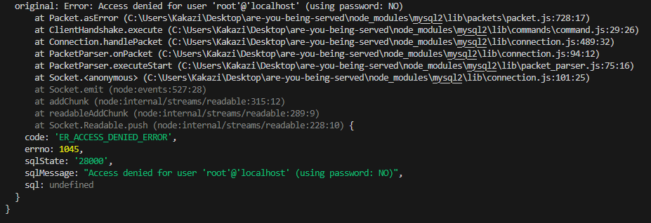

# are-you-being-served

## Description
Create an ecommerce backend website.

## Technology Used
* [Git](https://git-scm.com/)
* [Javascript](https://developer.mozilla.org/en-US/docs/Web/JavaScript)
* [NodeJS](https://nodejs.org/en)
* [dotenv](https://www.npmjs.com/package/dotenv)
* [Node MySQL 2](https://www.npmjs.com/package/mysql2)
* [Sequelize](https://sequelize.org/)
* [Express](https://expressjs.com/)

## Status
Incomplete. 

Wtih the attempt to seed the database, errors were received that weren't resolved:  

## License
[MIT](https://opensource.org/license/mit/) License